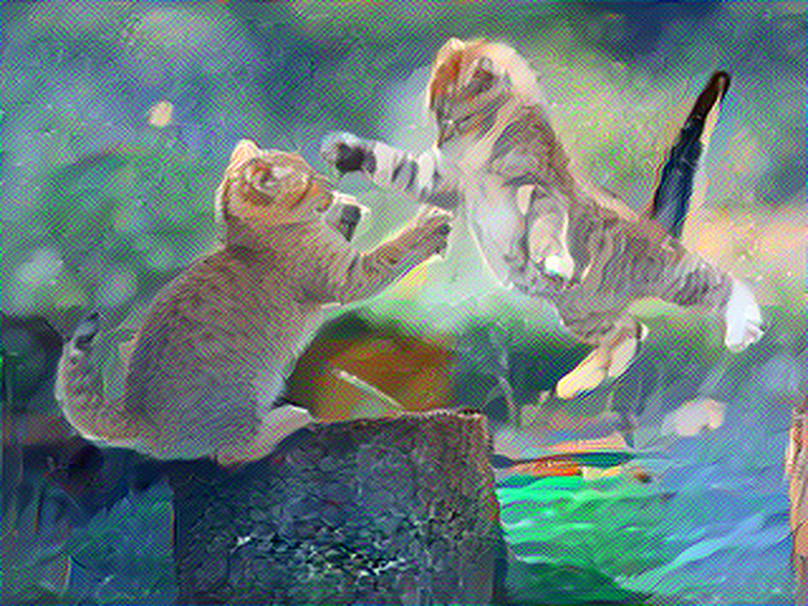

# Neural Style Transfer

[](https://pytorch.org/)
[](https://python.org/)
[](LICENSE)

> Transform images by combining the content of one image with the artistic style of another using deep neural networks.

<div align="center">
  
  <p><em>Example: Content image transformed with artistic style</em></p>
</div>

## 🎨 What is Neural Style Transfer?
Neural Style Transfer blends the content of one image with the artistic style of another using a deep CNN. This repo implements a reproducible PyTorch pipeline with a VGG19(IMAGENET1K_V1) Pre-trained Model  backbone, L‑BFGS optimization, and style loss via Gram matrices.

- Based on: Gatys et al., “A Neural Algorithm of Artistic Style” ([arXiv:1508.06576](https://arxiv.org/pdf/1508.06576))
- Backbone: `torchvision` VGG19 (ImageNet weights)
- Optimizer: L‑BFGS
- Losses: Content + Style (Gram matrices)

## 🗂️ Inputs and Output
- Input images:
  - `Input/content.jpg`
  - `Input/style.jpg`
- Output image:
  - `Output/styled_image_high_quality.jpg`

| Content (Input/) | Style (Input/) | Output (Output/)              |
|------------------|----------------|--------------------------------|
| content.jpg      | style.jpg      | styled_image_high_quality.jpg |

## ✨ Features
- VGG19 features with safe ReLU and AvgPool for smoother optimization
- Smart resizing (preserves aspect ratio; multiples of 32)
- Automatic CUDA detection with CPU fallback
- Highly configurable layers, weights, and optimization

## ✅ Requirements
- Python >= 3.11
- PyTorch >= 2.8, TorchVision >= 0.23
- NumPy, Pillow, Pillow-HEIF, Matplotlib

## ⚙️ Setup (uv recommended)
Dependencies are pinned in `uv.lock` for reproducibility.

```bash
# Install uv (macOS/Linux)
curl -LsSf https://astral.sh/uv/install.sh | sh

# Create & activate virtual environment
uv venv .venv
source .venv/bin/activate  # on Windows: .venv\Scripts\activate

# Install dependencies strictly from uv.lock
uv sync --frozen

# To update the lockfile later:
# uv lock --upgrade && uv sync
```

Optional: `requirements.txt`
```bash
uv pip freeze > requirements.txt
# or
uv pip compile pyproject.toml -o requirements.txt
```

## 🚀 Quick Start

### Option 1: Jupyter Notebook (Recommended)
Open and run `style_Transfering.ipynb`. Place your images as:
- `Input/content.jpg`
- `Input/style.jpg`

The output will be saved to `Output/styled_image_high_quality.jpg`.

### Notebook workflow (what it does, no code)
- Loads content and style images; converts to tensors with ImageNet normalization.
- Resizes while preserving aspect ratio; aligns spatial dims to multiples of 32.
- Builds a VGG19 feature extractor; replaces in-place ReLU with out-of-place; uses AvgPool.
- Selects content and style layers (e.g., `relu4_2` for content; multiple `relu*_1` for style).
- Computes content and style losses (style via Gram matrices).
- Optimizes the image with L‑BFGS until convergence.
- Saves the stylized result to `Output/`.

### Option 2: Minimal script (guidance, no code)
- Modularize: Move the notebook classes (e.g., `imageResizer`, `VGGFeatureExtractor`, `styleTransfering`) into a module like `style_transfer.py`.
- Create `minimal.py` that:
  - Imports the class (e.g., `from style_transfer import styleTransfering`).
  - Instantiates with your preferred content/style layers.
  - Calls `.transfer_style(...)` with paths and parameters.
  - Saves the resulting image under `Output/`.
- Run:
```bash
python minimal.py
```

## 🔧 Configuration

### Key parameters
- iterations: number of optimization steps (typical 300–1000)
- target_size: working resolution (higher = better detail, more memory)
- content_layers / style_layers: VGG19 layers used for losses
- content_weight / style_weight: balance structure vs. texture (higher style_weight → more painterly)

### Performance tips
- Faster: reduce `iterations` (300–400) or `target_size` (256–384)
- Higher quality: increase `iterations` (800–1000) and `target_size` (768–1024)
- Memory pressure: lower `target_size` or use CPU
- Instability/NaNs: reduce `style_weight` (e.g., 1e5) or `target_size`

## 📁 Project Structure
```text
Ghibli/
  Data/
    Artworks/                   # Sample style images (optional)
    TestCases/                  # Sample content images (optional)
  Input/
    content.jpg                 # Your content image
    style.jpg                   # Your style image
  Output/
    styled_image_high_quality.jpg  # Generated result
  style_Transfering.ipynb       # Main notebook
  main.py                       # Script entry point (optional)
  pyproject.toml                # Dependencies
  uv.lock                       # Locked dependencies
  README.md
```

## 🧠 How It Works (high level)
- VGG19 Feature Extractor: pre-trained on ImageNet to provide multi-scale features.
- Content Loss: preserves high-level structure from deeper layers (e.g., `relu4_2`).
- Style Loss: matches Gram matrices across multiple layers to capture texture statistics.
- L‑BFGS: second‑order optimization directly on the pixels of the generated image.

<div align="center">
  
  <p><em>Pipeline: Content and style features are extracted and combined</em></p>
</div>

## 🧩 Troubleshooting
- CPU runs: lower `target_size` or `iterations`.
- CUDA issues: ensure PyTorch build matches your CUDA drivers.
- NaNs/instability: lower `style_weight` (e.g., 1e5) or use smaller `target_size`.

## 📚 References
- Gatys, L. A., Ecker, A. S., & Bethge, M. (2015). A Neural Algorithm of Artistic Style. [arXiv:1508.06576](https://arxiv.org/pdf/1508.06576).
- Pre-trained VGG19 from `torchvision.models` (ImageNet weights)
- PyTorch docs: https://pytorch.org/docs/

## 📄 License
MIT (or your preferred license)

---
Made with ❤️ by Abhay Kumar Singh


